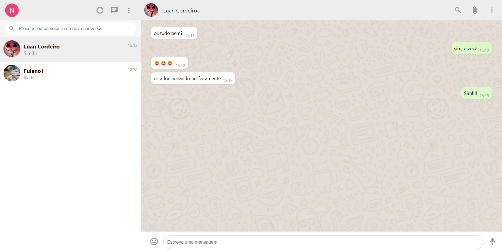

<h1 style="text-align: center;">Whatsappclone</h1>
<p>Send messages to your friends and have fun😃!</p>

## Indice
- [preview](#😁-preview)
- [about](#📃-about)
- [tools](#🔨-tools)
- [how to contribute](#♻️-how-to-contribute)

## 😁 Preview


## 📃 About

**Whatsappclone** is a project create by me to send messages to my friends while i am learn web development. It's a way to showcase and pratice my skills.

## 🔨 Tools
- [React](https://legacy.reactjs.org/)
- [Typescript](https://www.typescriptlang.org/)
- [Firebase](https://firebase.google.com/?hl=pt-br) (firestore, fireauth)
- [Vite](https://vitejs.dev/)
- [Styled-Components](https://styled-components.com/)

## ♻️ How to contribute

```bash
    # Clone the project
    $ git clone https://github.com/Luan-Costa-2l/whatsappclone
```

```bash
    # Open the directory
    $ cd whatsappclone
```

```bash
    # Install the dependecies
    $ npm install
```

```bash
    # Run the project
    $ npm run dev
```